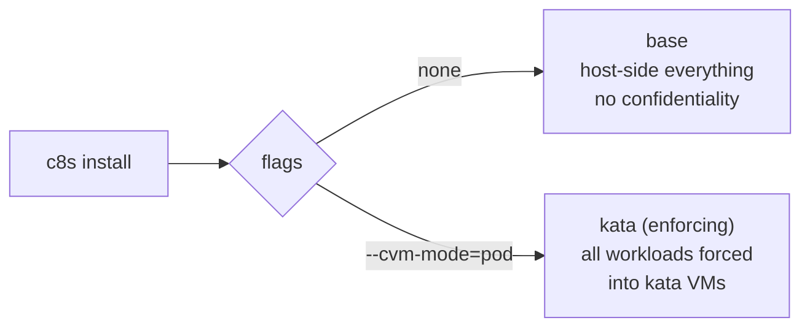
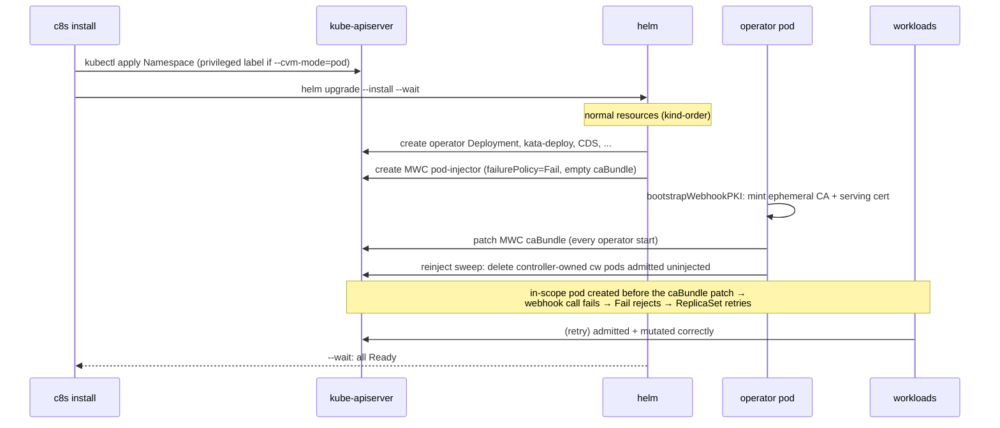
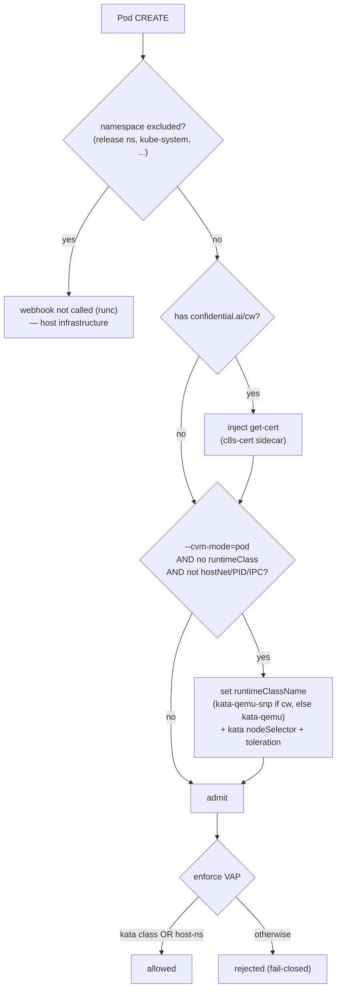
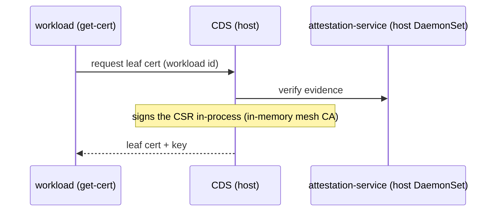
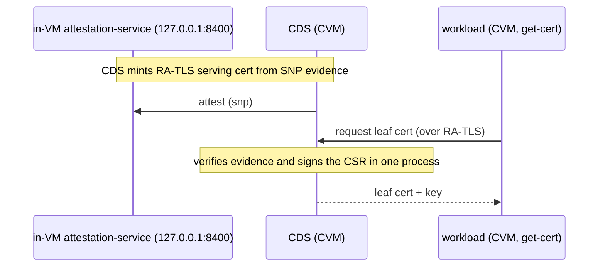
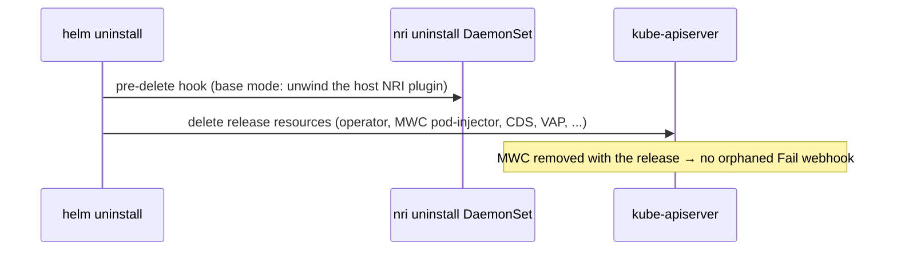

# c8s install flows and features (non-kata vs kata)

How `c8s install` assembles the platform, and how the runtime behaviour
differs across the two install modes. This is the overview that ties the
deeper docs together:

- [`kata.md`](kata.md) — the kata runtime install + enforcement, in depth.
- [`kata-guest-base.md`](kata-guest-base.md) — the confidential guest
  image design: how it boots, how a pod reaches end-to-end attestation,
  and why it lives here. (The recipe and what's baked in live in
  [`kata-guest-base/README.md`](../kata-guest-base/README.md).)
- [`kata-image-policy.md`](kata-image-policy.md) — in-guest per-image
  enforcement (`policy-monitor`).
- [`operator.md`](operator.md) — the operator, webhook, and controllers.
- [`THREAT_MODEL.md`](THREAT_MODEL.md) — the adversary and trust boundary.

**Reading order (start here).** This doc is the map; read it first, then
[`kata-guest-base.md`](kata-guest-base.md) (the guest-image concept) →
[`kata-image-policy.md`](kata-image-policy.md) (in-guest enforcement) →
[`kata.md`](kata.md) (install/ops reference) → [`pitfalls.md`](pitfalls.md).

The source of truth for the mode→helm-args mapping is `cmd/c8s/install.go`
(`appendKataInstallArgs` / `appendDistroInstallArgs`); for the rendered
resources, `internal/helmchart/c8s/templates/`.

---

## The two modes

`c8s install` runs `helm upgrade --install` against the embedded chart. One
flag selects a **mode**, which is a fixed set of `--set` choices.

| Mode | Flag | One-liner |
|---|---|---|
| **base** | *(none)* | Normal Kubernetes. No kata, no per-pod confidentiality. Host-side mesh + attestation + image policy. The dev/baseline shape. |
| **kata** | `--cvm-mode=pod` | Installs the kata runtime + RuntimeClasses **and enforces them**: the webhook *injects* a kata RuntimeClass into every in-scope workload pod, a ValidatingAdmissionPolicy *rejects* non-kata pods, and the host-side mesh/attestation/image-policy move into the guest image. The production "pod-as-CVM" shape — kata is enforcing, there is no kata-without-enforcement mode. |



There is no distro flag: the host distro (`k8s` vs `rke2`), which picks the
containerd config paths for kata-deploy and nri-image-policy in every mode,
is detected from the cluster's kubelet versions (`+rke2` build suffix →
rke2). An install with `-f` values owns the distro instead: set
`kata.distro` / `nriImagePolicy.distro` there if the chart default (`k8s`)
doesn't fit — a mixed cluster cannot be detected and always needs that, plus
nodeSelectors to partition the install.

The kata-image-puller and node-taint sidecar are on by default under `--cvm-mode=pod`.
A single-node / local build can switch either off, and pin the guest image
tag, through a `-f` values file (`kata.guestImage.enabled=false` /
`kata.nodeTaint.enabled=false` / `kata.guestImage.tag=<tag>`) — there is no
dedicated CLI flag for these.

`--cvm-mode=pod --debug` points the puller at the `<tag>-debug` guest image —
identical except the baked guest policy allows host log/exec streams, so
`kubectl logs` / `kubectl exec` work against kata pods. Container I/O becomes
host-readable and the launch measurement differs from the locked image; dev
only (see [`kata.md`](kata.md)).

---

## What runs where (feature matrix)

✓ = present, ✗ = not rendered. "host" = ordinary container on the node;
"CVM" = `kata-qemu-snp` confidential VM; "in-VM" = baked into the guest image,
not a cluster resource.

| Component | base | `--cvm-mode=pod` | Runs on |
|---|:--:|:--:|---|
| c8s operator (webhook + controllers) | ✓ | ✓ | host (runc; always webhook-exempt) |
| MWC `pod-injector` | ✓ | ✓ | cluster (release-tracked resource) |
| **CDS** (Certificate Distribution Service: verify + EAR + mesh-CA + leaf signing) | ✓ host | ✓ **CVM** | runc in base, `kata-qemu-snp` under kata |
| attestation-service | ✓ host | ✗ (in-VM) | host DaemonSet in base; baked into the guest image under kata |
| ratls-mesh | ✓ host | ✗ (in-VM) | host DaemonSet in base; in-VM routing under kata |
| nri-image-policy | ✓ host | ✗ (in-VM) | host NRI plugin in base; in-guest `policy-monitor` under kata (fed from CDS's served allowlist) |
| kata-deploy DaemonSet | ✗ | ✓ | host (privileged, hostPID/hostNetwork) |
| kata RuntimeClasses | ✗ | ✓ | cluster |
| kata-image-puller | ✗ | ✓¹ | host (privileged) |
| node-taint | ✗ | ✓² | host (kata-deploy sidecar) |
| kata-enforcement VAP | ✗ | ✓ | cluster |
| RuntimeClass injection (workloads) | ✗ | ✓ | webhook (admission time) |
| get-cert injection (`confidential.ai/cw` pods) | ✓ | ✓ | webhook (admission time) |
| tls-lb (bundled workload) | ✓ | ✓ CVM | runc in base; `kata-qemu-snp` CVM under kata (pinned by the chart) |

¹ on by default; disable via `-f` values (`kata.guestImage.enabled=false`)  ² on by default; disable via `-f` values (`kata.nodeTaint.enabled=false`)

Under kata, **every host-side security component (attestation-service,
ratls-mesh, nri-image-policy) moves *inside* the confidential guest**, where
the host (adversarial) cannot tamper with it. `c8s install --cvm-mode=pod` sets their
`.enabled=false`, and the chart fails the render
(`kind=enforce_host_components`, `templates/validations.yaml`) if any is left
enabled alongside `kata.enabled` — the host versions would be a second,
unattested enforcement path.

---

## Trust boundary by mode

**base** — there is no per-pod confidentiality. Everything runs in ordinary
containers the host kernel can read. The mesh/attestation components operate at
the node level; they do not hide pod memory from the host.

```
 HOST (trusted in this mode)
 ┌─────────┐ ┌────────┐ ┌────────────┐ ┌───────────────────┐
 │operator │ │  CDS   │ │ratls-mesh  │ │attestation-service│
 │+webhook │ │ (runc) │ │nri-img-pol │ │   (host DaemonSet) │
 └─────────┘ └────────┘ └────────────┘ └───────────────────┘
```

**kata** — the host is adversarial. Workloads and the c8s CDS run
inside `kata-qemu-snp` CVMs whose memory is SEV-SNP-encrypted; the security
services they rely on are *baked into the guest image* (part of the launch
measurement), not provided by the host.

```
 ══════════════ TEE boundary — SEV-SNP encrypted, host cannot read ══════════════
  ┌──────── kata-qemu-snp CVM ────────┐ ┌──── kata-qemu-snp CVM ────┐
  │ CDS                               │ │ workload                  │
  │  RA-TLS serving cert              │ │  + get-cert sidecar       │
  │  (snp evidence)                   │ │  (leaf from CDS)          │
  │ baked-in: attestation-service · ratls-mesh · policy-monitor (all in-VM) │
  └───────────────────────────────────┘ └───────────────────────────┘
 ════════════════════════════════════════════════════════════════════════════════
  HOST (adversarial)
  ┌─────────────┐ ┌──────────────┐ ┌───────────────────┐ ┌────────────────────┐
  │ c8s operator│ │ kata-deploy  │ │ kata-image-puller │ │ containerd         │
  │ + webhook   │ │ installs the │ │ stages the guest  │ │ + containerd-shim- │
  │ (runc)      │ │ kata runtime │ │ image + config    │ │   kata-v2          │
  └─────────────┘ └──────────────┘ └───────────────────┘ └────────────────────┘
```

The host-side pods that remain under kata — operator, kata-deploy,
kata-image-puller — are **infrastructure that cannot itself
run inside a CVM** (they install/serve the very thing CVMs depend on). They are
explicitly outside the trust boundary and are exempt from kata injection (see
[Admission flow](#admission-flow)).

---

## Install flow (ordering)

The MWC `pod-injector` is an **ordinary release-tracked resource**: Helm's
kind-order applies it *after* the Deployments, with an empty `caBundle` and
`failurePolicy: Fail`. The chart's own pods never depend on it — the MWC's
namespaceSelector excludes the release namespace — and workload pods are
annotated only after `helm --wait` reports the release ready.



Key properties (see `templates/webhook.yaml`, `controller/runner.go`):

- **`failurePolicy: Fail`** means the window where the MWC exists but the
  operator hasn't patched the caBundle yet *fails closed* — pod creation is
  rejected and retried, never admitted as an unmutated runc pod.
- The **chart's own components are exempt** via the MWC's namespaceSelector,
  which excludes the release namespace (plus `kube-system`, `kube-public`,
  `kube-node-lease`, and `webhook.extraExcluded`), so the operator can always
  boot to patch the caBundle — no deadlock.
- The webhook CA is **ephemeral**: `bootstrapWebhookPKI` re-mints it and
  re-patches the caBundle on every operator start. The chart renders the
  `caBundle` field only when `webhook.caBundle` is set, so a `helm upgrade`
  leaves the operator-patched bundle in place and MWC spec changes roll out
  like any other resource.
- A `cw` pod admitted while the webhook was unavailable (e.g. before the MWC
  existed on first install) cannot self-heal — admission fires only on CREATE
  — so the operator runs a **one-shot reinject sweep** at startup that deletes
  controller-owned `cw` pods missing injection; their controllers recreate
  them through the webhook.
- CDS comes up during the main install and, living in the excluded release
  namespace, is never gated on the webhook — bootstrap services must not be
  gated behind the workloads that depend on them.

---

## Admission flow

Every CREATE of a pod in an in-scope namespace hits the `pod-injector` MWC. The
operator's handler (`internal/webhook/pod_mutator.go`) decides:



Two independent injections, both keyed off the pod (not a CR):

1. **get-cert** — driven by the `confidential.ai/cw=<id>` annotation, in
   **any** mode. Injects a `c8s-cert` native sidecar that fetches the
   leaf cert from CDS on startup and renews it on a ticker, plus a
   `c8s-cert-wait` run-once init container (`/c8s probe-file --wait`) that
   blocks until the initial cert is written so downstream containers wait for
   it before launching. (An exec startupProbe cannot gate here: the locked
   kata guest denies `ExecProcessRequest`.)
2. **runtimeClass** — only under `--cvm-mode=pod` (which is enforcing).
   `kata-qemu-snp` for `cw`-annotated pods (confidential), `kata-qemu`
   otherwise.

**Exemptions** (the `webhook.yaml` MWC and the `kata-enforcement.yaml` VAP
binding render the same namespaceSelector exclusion list and must stay in
sync):

- **excluded namespaces** — the release namespace (operator, CDS,
  kata-image-puller: host infrastructure that installs/serves what CVMs
  depend on — the puller cannot run as a kata VM, its `/host` bind-mount
  would map into the guest) plus `kube-system`, `kube-public`,
  `kube-node-lease`, and `webhook.extraExcluded`.
- **host-namespace pods** (`hostNetwork`/`hostPID`/`hostIPC`) — a VM cannot
  share the host's namespaces. This is how `kata-deploy` (which sets
  `hostPID`+`hostNetwork`) is left as runc.

> **Why CDS doesn't use `cw` for its runtimeClass.** It must be a
> CVM, but it must *not* get a get-cert sidecar: that sidecar dials CDS,
> and CDS dialing itself from its own init container is a bootstrap deadlock.
> So it pins `runtimeClassName: kata-qemu-snp` **directly** in its pod
> template (gated on `kata.enabled`) and carries no `cw` annotation. It
> self-provisions its serving cert via RA-TLS bound to the SNP measurement.

---

## Certificate and attestation flows

**base (host attestation).** Workloads annotated `cw` get a get-cert sidecar
that dials CDS over the cluster Service (`--cds-url`); CDS verifies the request
against the **host** attestation-service DaemonSet and signs the CSR with its
in-memory mesh CA — verify and sign happen in one process.



**kata (in-VM attestation + RA-TLS).** The host attestation-service is off;
`attestationService.url` is `http://127.0.0.1:8400`, the in-VM service baked
into the guest. CDS self-provisions its own *serving* cert via RA-TLS using SNP
evidence from its own CVM before it serves. Workloads still get-cert from CDS,
but CDS now runs inside its CVM.



In kata mode the trust anchor is the **launch measurement**: CDS,
attestation-service, ratls-mesh, and policy-monitor are all part
of the guest image whose SNP digest a client verifies — see
[`kata-guest-base.md`](kata-guest-base.md) and
[`kata-image-policy.md`](kata-image-policy.md).

---

## Uninstall flow

The MWC is release-tracked, so `helm uninstall` deletes it along with every
other release resource — a `failurePolicy: Fail` webhook pointing at a deleted
operator Service cannot leak and block pod creation cluster-wide. The only
`pre-delete` hook in the chart is the nri-image-policy uninstall DaemonSet
(`templates/nri-image-policy-uninstall-hook.yaml`, base mode only), which
unwinds the host-side NRI plugin install before the release goes.



kata-deploy separately runs `kata-deploy cleanup` on `preStop` to unwind the
host runtime install.

**`c8s uninstall`** wraps the helm step and adds the kata host sweep the
preStop hook cannot guarantee: after the release is gone, a short-lived
privileged DaemonSet removes whatever survived on each node — `/opt/kata`, the
containerd runtime drop-in (restarting the runtime only if it was still
registered), the pulled kata-guest-base artifact, the RKE2 containerd-prep
template — plus the `katacontainers.io/kata-runtime` node labels. It refuses
to run under live kata pods (`--force` overrides), reads the release values
before deletion so install-time `-f` overrides are honored, and
`--host-sweep-only` recovers a cluster whose release a bare `helm uninstall`
already deleted. See [`kata.md`](kata.md#uninstalling).

---

## Quick reference

```bash
# --upstream (with the port on its --workload-ref) points tls-lb at an adopted
# workload's mesh-wrapped headless Service for every flow below
# (see operator.md, "tls-lb upstream").

# Base — normal cluster, host-side components, no confidentiality.
c8s install --workload-ref vllm=<namespace>/deployment/<vllm-deployment>:8000 --upstream vllm

# Kata (enforcing): every workload pod becomes a kata VM, non-kata pods
# rejected, host-side mesh/attestation/image-policy replaced by their
# in-guest counterparts.
c8s install --cvm-mode=pod --workload-ref vllm=<namespace>/deployment/<vllm-deployment>:8000 --upstream vllm

# RKE2 host — the distro is detected from the cluster, no extra flag.
c8s install --cvm-mode=pod --workload-ref vllm=<namespace>/deployment/<vllm-deployment>:8000 --upstream vllm

# Single-node / local build (no registry artifact, don't starve the one node).
# The puller + node-taint are on by default; switch them off via a values file:
#   kata: {guestImage: {enabled: false}, nodeTaint: {enabled: false}}
c8s install --cvm-mode=pod --workload-ref vllm=<namespace>/deployment/<vllm-deployment>:8000 --upstream vllm -f single-node.values.yaml

# Uninstall: helm uninstall + sweep the kata artifacts off every node.
c8s uninstall
```

For the deeper "why" behind any of the kata pieces, follow the cross-links at
the top of this document.
